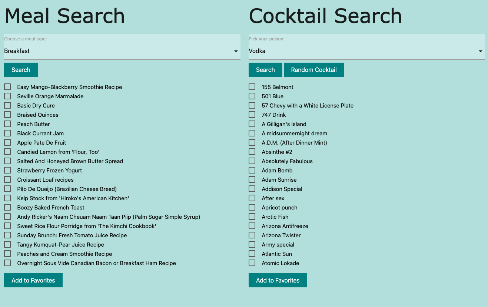
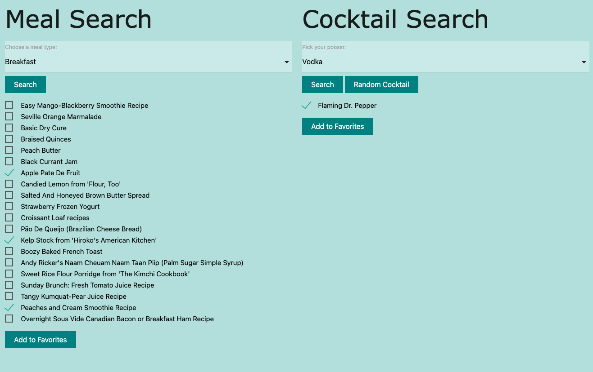
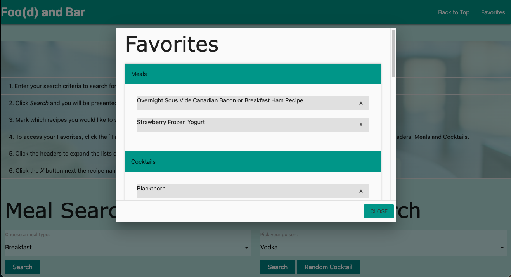

# Recipe + Cocktail Generator
# *Foo(d) and Bar*

## Description

We wanted to create an app that allows users to search for food and cocktail recipe names based on criteria like alcohol type and meal type (breakfast, lunch, and dinner).

You’ve had a lot going on and haven’t had time to come up with good food and drink recipes or maybe you are looking to try something new. It would be great to have a an app where you can receive some randomized recommendations.

### Problem
It’s been a long a week, you’re unwinding at home when you remember you’ll be hosting this weekend's get together and need to have food and drinks prepared. Just one problem, you have no idea what to make.

### Solution
Use a random recipe and cocktail generator to search and save your favorites and reference them quickly.

### Technologies Used
- HTML
- CSS
- JavaScript
- [Materialize - a CSS Framework](https://materializecss.com/)
- [Edamam Recipe Search API](https://developer.edamam.com/edamam-recipe-api)
- [TheCocktailDB API](https://thecocktaildb.com/api.php)

## Table of Contents

- [Collaborators](#collaborators)
- [User Story](#user-story)
- [Acceptance Criteria](#acceptance-criteria)
- [How to](#how-to)
- [Future Development](#future-development)
- [Screenshots](#screenshots)

## Collaborators

| Developer | GitHub Profile |
| --- | ----------- |
| Sara | https://github.com/sasterck |
| Pat | https://github.com/Pjmeyer95 |
| John | https://github.com/JohnBaldwin82 |
| Sergio | https://github.com/sergiorodriguezdev |

## User Story

```
AS A food and drink connoisseur
I WANT to be able to find food + cocktail recommendations based on the meal type and alcohol type selected in a search
SO THAT I can save the ideas for quick references.
```

## Acceptance Criteria

```
GIVEN a meal and cocktail search app
WHEN I search for a meal based on parameters provided
THEN I see a list of meal names
WHEN I search for  a cocktail based on parameters provided
THEN I see a list of cocktail names
WHEN I click the “Random Cocktail” button
THEN I see a single cocktail name which was chosen at random
WHEN I mark a recipe name(s) (meal or cocktail) as a favorite and click “Add to Favorites”
THEN these names are added to my list of favorites
WHEN I click the navigation links in the navigation bar
THEN I am taken to the corresponding sections in the app
WHEN I click the Favorites navigation link
THEN I am presented with a list of recipe names I have marked as favorites
WHEN I see the list of favorite recipe names and click the “Remove” button
THEN the individual recipe is removed from my list of favorites
```

## How To

Access the app [HERE](https://johnbaldwin82.github.io/project-01/)

1. Select your search criteria from the drop down options provided to search for meal or cocktail recipes.
2. Click `Search` and you will be presented with a list of recipe names.
3. Mark which recipes you would like to save to your **Favorites** by clicking their corresponding checkbox. Then, click `Add to Favorites`.
4. To access your **Favorites**, click the `Favorites` link in the navigation bar at the top. You will be presented with a dialog box (a modal) with two headers: Meals and Cocktails.
5. Click the headers to expand the lists of your favorite recipes.
6. Click the `X` button next the recipe name to remove the recipe from your favorites.

## Future Development

To increase the accuracy and pairing of the generated recommendations and add a sharing feature. Why? We would like to see it filter cocktails based on time of day and pair the selected meal with matching cocktail. It would be beneficial to also have a sharing feature so you can send your friends your favorite pairings. 

## Screenshots







